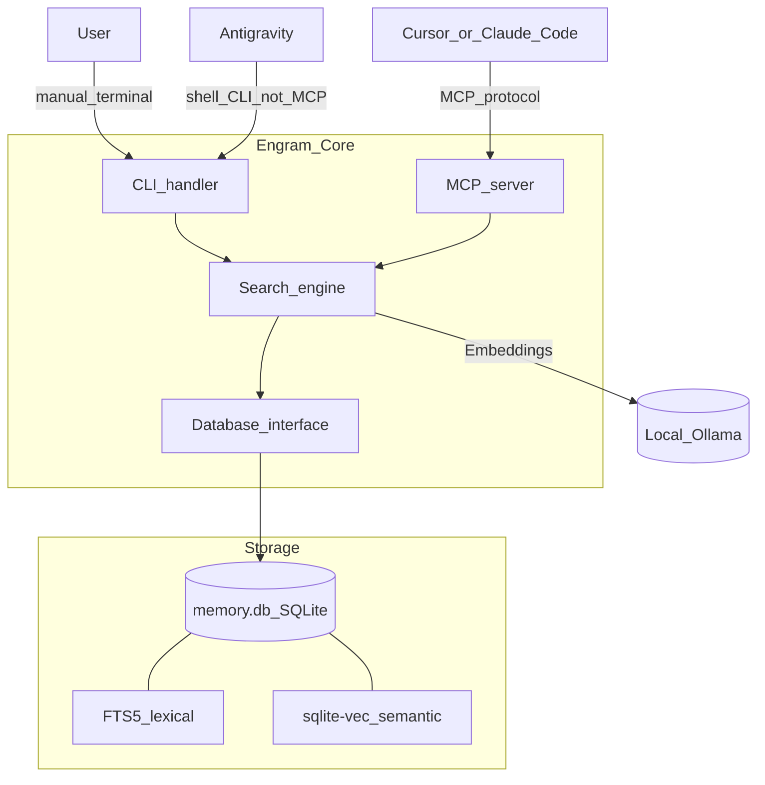
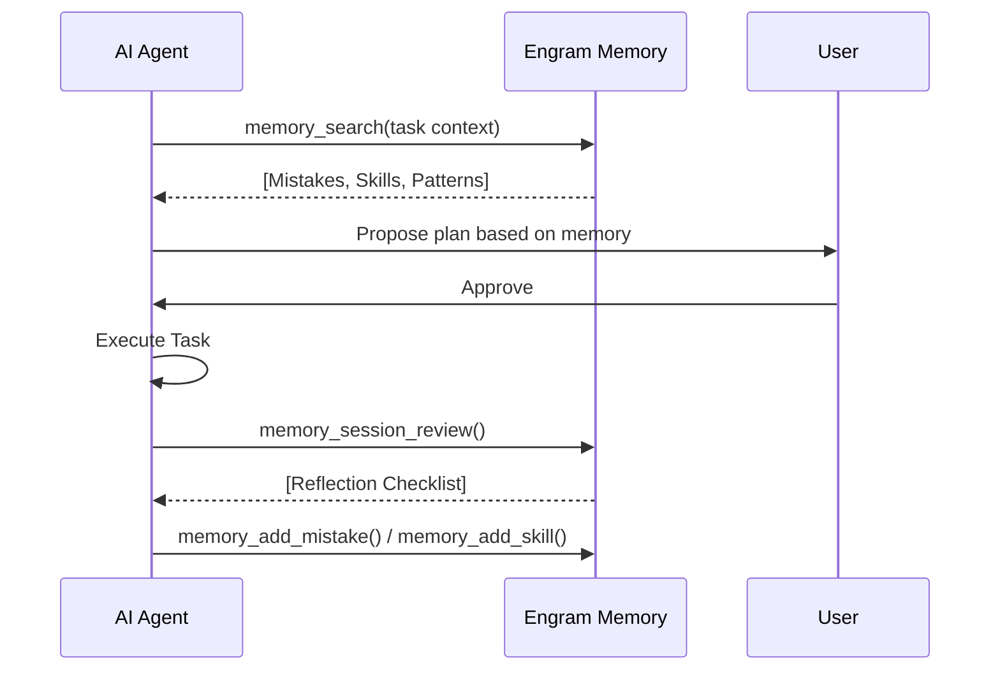

# 🧠 Engram


**Persistent engineering memory for AI-assisted development.**  
Stop repeating mistakes. Reuse proven workflows. Recognize familiar problems instantly.

[](LICENSE)
[](https://python.org)
[](#architecture)

---

## Why Engram?

AI assistants are brilliant but stateless. They forget every lesson learned as soon as a chat session ends. Engram fixes this by maintaining a **queryable memory database** that persists across sessions and projects:

- **Mistakes** — "We tried flood-fill on alpha edges before, it doesn't work. Use the tinting approach."
- **Patterns** — "This looks like the API Parameter Mismatch pattern. Look up the ID from the listing endpoint first."
- **Skills** — "There's already a proven workflow for this. Follow steps 1-5 instead of figuring it out again."
- **Codebase Knowledge** — "I've mapped this project. Here are the key file summaries without re-reading everything."

## Architecture

Engram uses a hybrid search engine combining **SQLite FTS5** (lexical) and **sqlite-vec** (semantic) to retrieve relevant context.



**How clients connect:** **Cursor** (and other MCP-capable IDEs) call Engram through the **MCP server** (`memory_search`, `memory_add_*`, etc.). **Antigravity** has no Engram MCP in the default flow—the agent runs the same operations via **`python3 -m src.cli`** (see bootstrapped `.antigravity/instructions.md`). Both paths hit the same search engine and database.

## Quick Start

The easiest way to get started is using the unified setup script:

```bash
git clone https://github.com/luismiguelcota/engram.git
cd engram
bash scripts/setup.sh
```

This script will:
1. Check your Python environment (>= 3.9).
2. Install dependencies (`sqlite-vec`, `sqlean-py`).
3. Configure **Ollama** for semantic search.
4. Initialize and seed your local memory database.

## Agent Integration

Engram turns AI assistants into senior partners who remember your project's history.

### Cursor vs Antigravity at a glance

| | **Cursor** | **Antigravity** |
|---|------------|-----------------|
| **How Engram is wired** | `.cursor/rules/engram.mdc` + optional [Cursor hooks](cursor-hooks/session-capture.js) | `.antigravity/instructions.md` (from `engram bootstrap`) |
| **Primary interface** | **MCP tools** (`memory_search`, `memory_suggest_capture`, `memory_add`, …) | **CLI** (`python3 -m src.cli …` from the Engram repo root or `PATH`) |
| **Session capture** | Hooks can call `suggest-capture` on stop / session end | Agent runs `suggest-capture` per instructions (heuristic, same engine) |
| **Skill import/export** | Yes (`engram import-cursor-skills`, `export-skills`) | Use CLI / memory search; no separate Antigravity skill sync |

**Same behavior, different channel:** search, add, and suggest-capture map 1:1 between MCP and CLI; pick one client per project or use both for different tasks—avoid writing the same memory twice by agreeing which tool runs capture.

### 1. Bootstrap your Project
Run this in any repository you want your AI agent to remember:
```bash
engram bootstrap
```
This creates `.cursor/rules/engram.mdc` for Cursor and `.antigravity/instructions.md` for Antigravity. You will be prompted to choose an **engagement mode**.

### 2. Engagement Modes

Engram supports three engagement modes — choose based on your project's complexity and how much ceremony you want.

| Mode | Default Behavior | Best For |
|------|-----------------|----------|
| **Adaptive** *(recommended)* | LIGHT by default; escalates automatically on complexity signals | Most projects — balances speed with memory |
| **Full** | Always-on: session init, memory search, retrospective every session | Long-running complex projects, architecture work |
| **Minimal** | Off by default; only activates on explicit user request | Quick scripts, prototypes, low-stakes work |

```bash
# Interactive prompt (recommended)
engram bootstrap

# Or set mode directly
engram bootstrap --mode adaptive
engram bootstrap --mode full
engram bootstrap --mode minimal
```

#### Adaptive Mode — How It Works

Adaptive mode starts every session in **LIGHT** mode (one quick memory search, no ceremony) and escalates automatically to **FULL** mode when complexity is detected.

**Escalation triggers** (Cursor + Antigravity):
- 3+ failed attempts or error messages
- Keywords: `debug`, `refactor`, `architecture`, `investigate`, `performance`, `security`
- Changes span 5+ files or mention "project-wide"
- Session exceeds 10 turns
- You say: `check engram`, `use engram`, or `@engram full`

**User overrides** (Cursor):

| Say | Effect |
|-----|--------|
| `@engram full` | Force full mode immediately |
| `@engram off` | Disable for this session |
| `@engram light` | Return to light mode |
| `@engram status` | Report current mode |

**User overrides** (Antigravity):

| Say | Effect |
|-----|--------|
| `use engram` / `check memory` | Activate full mode |
| `quick question` / `no engram` | Keep Engram disabled |
| `simple fix` | Stay in light mode |

### 3. Committee-Driven Workflow (Full Mode)

When in Full mode, Engram uses a structured SDLC where agents act as a "committee" (Analyst, Researcher, Skeptic, Archivist) to prevent shallow decisions.



*Antigravity / CLI:* use the same flow with `python3 -m src.cli search`, `add session`, `add transcript`, `add decision`, and `suggest-capture` before persisting; see `.antigravity/instructions.md` for exact commands.

### 4. Skill Sync (Cursor ↔ Engram)

Proven Engram skills can be exported as permanent Cursor skills — and Cursor skills can be imported into Engram for semantic search.

```bash
# See what's out of sync
engram sync-skills --dry-run

# Export proven skills to Cursor (usage >= 2)
engram export-skills --min-usage 2

# Import all Cursor skills into Engram
engram import-cursor-skills ~/.cursor/skills

# Bidirectional auto-sync
engram sync-skills --auto
```

## Claw-Code Integration (Optional)

Engram integrates directly with **Claw-Code** for high-performance execution. Use Claw as your agent's execution engine to get ultra-fast results while logging everything to Engram:

```bash
engram run "Optimizing image pipeline" --role Analyst --session-id "IMG-01"
```

*Note: Requires `claw` binary to be in your PATH or configured in `.env`.*

## CLI Reference

### Memory

| Command | Description |
|---------|-------------|
| `engram search "query"` | Search all memory (lexical + semantic) |
| `engram recent` | Show the 10 most recent memory entries |
| `engram add mistake` | Log a new mistake with root cause |
| `engram add pattern` | Log a recurring problem pattern |
| `engram add skill` | Log a proven, reusable workflow |
| `engram list skills` | List all stored skills |
| `engram stats` | Memory database statistics |
| `engram health` | Comprehensive health report |

### Project & Codebase

| Command | Description |
|---------|-------------|
| `engram index-project` | Create a persistent map of the current codebase |
| `engram query-codebase` | Search project-specific file summaries |
| `engram graph` | Visualize file dependency graph |

### Skill Sync

| Command | Description |
|---------|-------------|
| `engram export-skills` | Export Engram skills as Cursor SKILL.md files |
| `engram import-cursor-skills <path>` | Import Cursor skills into Engram |
| `engram sync-skills` | Diff and sync Engram ↔ Cursor skills directory |

### Bootstrap & Maintenance

| Command | Description |
|---------|-------------|
| `engram bootstrap [--mode adaptive\|full\|minimal]` | Set up agent rules for a project |
| `engram doctor` | Run diagnostics and fix database issues |
| `engram gc` | Garbage collect unused memories |
| `engram backup` | Export database to JSON |

## Embedding Models

Engram uses [Ollama](https://ollama.com) for local embedding generation. The default model is `nomic-embed-text`. You can switch models via the `ENGRAM_EMBED_MODEL` environment variable.

```bash
# Use the default (recommended)
engram search "database migration"

# Use a higher-quality model (requires `ollama pull mxbai-embed-large`)
ENGRAM_EMBED_MODEL=mxbai-embed-large engram search "database migration"

# Set permanently in your shell profile
export ENGRAM_EMBED_MODEL=mxbai-embed-large
```

### Model Comparison

| Model | Dimensions | Context | Size | Notes |
|-------|-----------|---------|------|-------|
| `nomic-embed-text` *(default)* | 768 | 8192 tokens | 274 MB | Best context window — handles long entries well |
| `mxbai-embed-large` | 1024 | 512 tokens | 670 MB | Highest MTEB score; short context |
| `bge-large-en-v1.5` | 1024 | 512 tokens | 670 MB | Strong English retrieval; short context |
| `snowflake-arctic-embed` | 1024 | 512 tokens | 669 MB | Fast inference; competitive quality |

**Recommendation:** Stick with `nomic-embed-text` unless you need higher semantic precision and are willing to trade the larger context window. Engram's hybrid FTS5 + semantic search reduces the impact of imperfect semantic quality.

> **Note:** Changing models invalidates all existing embeddings. Run `engram doctor --repair` after switching to regenerate them.

## Troubleshooting

If things aren't working as expected, run the built-in diagnostic tool:
```bash
engram doctor --repair
```
It will check for database drift, orphaned tags, and semantic engine connectivity.

## License

[MIT](LICENSE) — Luis Miguel Cota
