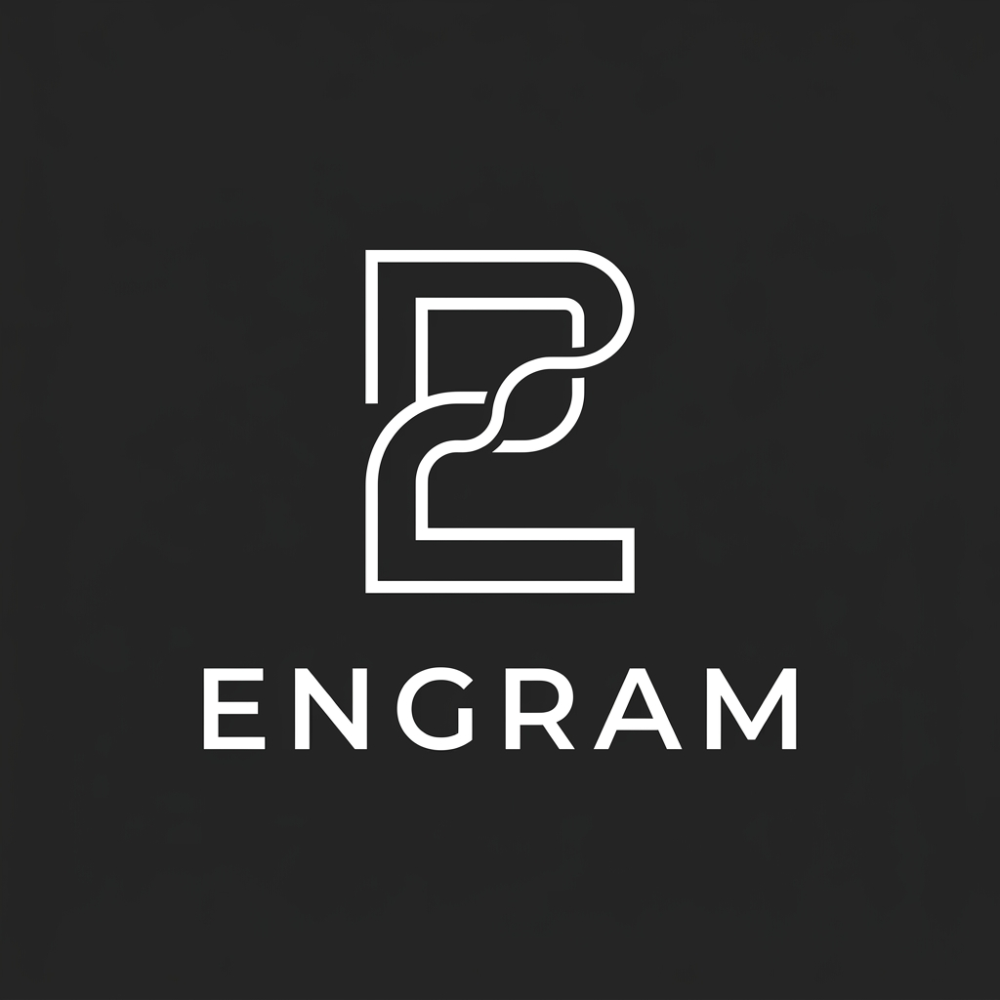
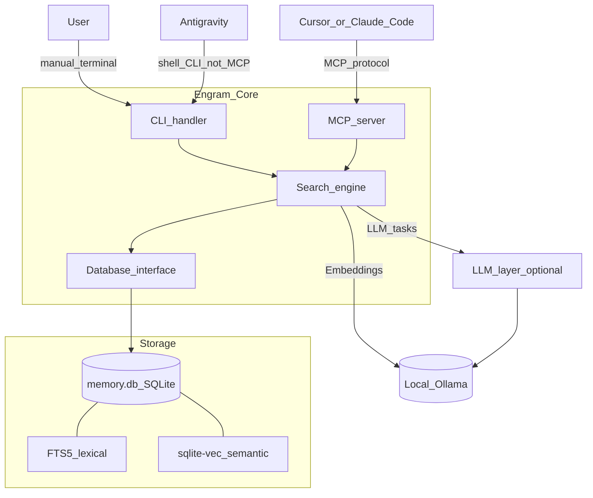
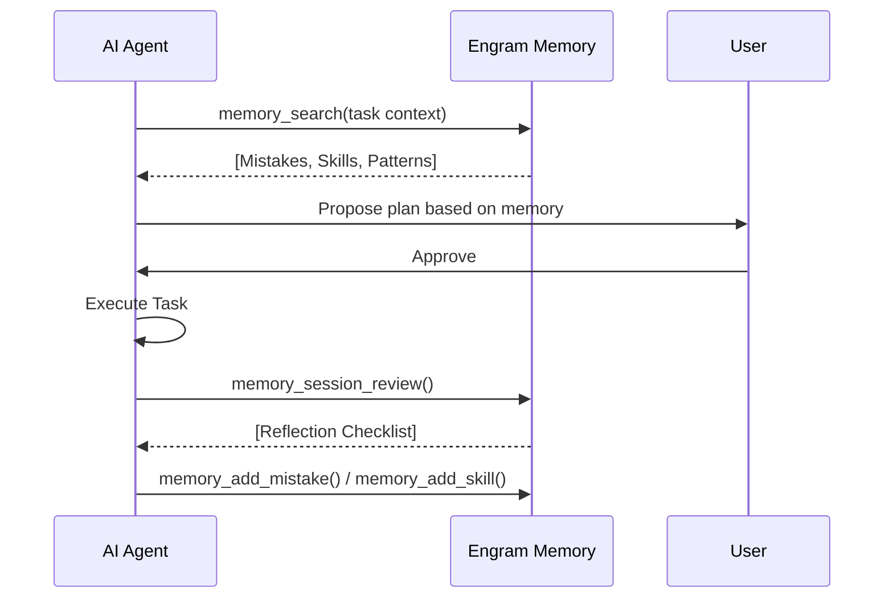

# 🧠 Engram



**Persistent engineering memory for AI-assisted development.**  
Stop repeating mistakes. Reuse proven workflows. Recognize familiar problems instantly.

[](LICENSE)
[](https://python.org)
[](#architecture)

---

## Why Engram?

AI assistants are brilliant but stateless. They forget every lesson learned as soon as a chat session ends. Engram fixes this by maintaining a **queryable memory database** that persists across sessions and projects:

- **Mistakes** — "We tried flood-fill on alpha edges before, it doesn't work. Use the tinting approach."
- **Patterns** — "This looks like the API Parameter Mismatch pattern. Look up the ID from the listing endpoint first."
- **Skills** — "There's already a proven workflow for this. Follow steps 1-5 instead of figuring it out again."
- **Codebase Knowledge** — "I've mapped this project. Here are the key file summaries without re-reading everything."

**Recent capabilities:**

- **Pinned memories** — pin critical entries so they always surface at the top of search (`memory_pin`, `memory_list_pinned`).
- **Write-time dedup** — `memory_add` blocks near-duplicate inserts unless you pass `force=true`.
- **Auto-extract** — draft memories from chat or task/outcome pairs (`memory_auto_extract`; LLM + regex fallback).
- **LLM maintenance** — consolidation audit and assisted GC (`engram llm audit`, `engram llm gc`); check status with `memory_llm_status` or `engram llm status`.
- **Temporal facts** — supersede stale entries and track time-bounded facts (schema v11; `memory_invalidate`).

Architecture decisions are documented in [`docs/decisions/`](docs/decisions/).

## The Action Ladder — memory that compiles into action

Engram is more than recall: it is a framework that makes agents cheaper and
more correct over time. Every task has three rungs, cheapest first:

```
REFLEX   ~50 tokens    approved deterministic script   ← earned by 5+ proven uses + human approval
RECALL   ~80 tokens    follow retrieved prior art      ← earned by capture + reuse
REASON   1000s tokens  full LLM derivation             ← the default for anything new
```

The reflex/recall figures are **measured** `engram route` output
(`python benchmarks/ladder_cost.py`); REASON's "1000s" is the counterfactual
cost of unaided reasoning that the lower rungs avoid — not an Engram
measurement. The load-bearing, testable claim is the ordering: reflex ≪ recall ≪ reason.

- **`engram route "task"`** (MCP: `memory_route`) — one budgeted call answers
  "what is the cheapest correct way to do this": a reflex to invoke, prior art
  to follow, or reason-then-capture. Known past mistakes ride along as pitfall
  warnings on every rung.
- **Reflexes** — skills proven by reuse get promoted (`engram promote <id>`)
  into scripts a human reviews and approves (`engram reflex approve`). Approval
  pins the script hash (edits un-approve); syntax is parse-checked; approved
  reflexes appear as native `reflex_*` MCP tools in every client. Two
  consecutive failures auto-demote and capture the failure as a mistake.
- **Monitors & inbox** — a reflex with `kind=monitor` watches a real system on
  a cron schedule (`engram schedule <id> "*/15 * * * *"`); firing files a
  deduped **inbox** alert instead of demoting. Agents can *propose* actions
  (`memory_propose_decision`) but never execute them: `engram inbox` +
  `engram decide <id> --approve [--run]` is the only proposal→execution path,
  human-invoked by construction. Delivery goes through a user-approved
  `notify` reflex (`engram notify-init`; osascript default, swap for any
  webhook) — the notification channel itself is under the trust model.
- **Self-maintenance** — `engram self-check` (cron it daily) files promotion
  candidates, flaky reflexes, hygiene issues and capture-quality warnings as
  inbox decisions: the system proposes its own upkeep; you decide.
- **Change journal** — mutating scripts emit `ENGRAM_CHANGE target=… before=…
  after=…`; every reported mutation is journaled and revertible-by-information.
- **Honest accounting** — `engram efficiency` reports measured floors only.

See [ADR 0006](docs/decisions/0006-action-ladder.md) for the design and its
scope fence.

**Full documentation:** [`docs/GUIDE.md`](docs/GUIDE.md) (concepts + lifecycle), [`docs/COMMANDS.md`](docs/COMMANDS.md) (complete CLI reference, auto-generated), [`docs/decisions/`](docs/decisions/) (ADRs). Validate that a memory actually changes behavior with `engram validate`; import Claude's native memories with `engram import-claude-memories`.

**Measured, not vibes:** Engram publishes reproducible numbers. On its home domain
(labeled real-corpus eval): **R@5 = 1.00 at 60–120 ms, ~560 context tokens/query**.
On the out-of-domain **LongMemEval oracle** (940 chit-chat sessions, retrieval-only,
fully local 274 MB embedder, no LLM): **session-level R@5 = 0.538 at 218 ms,
374 tokens/query** — with per-category numbers and honest comparability caveats in
[`benchmarks/BENCHMARKS.md`](benchmarks/BENCHMARKS.md).

## Architecture

Engram uses a hybrid search engine combining **SQLite FTS5** (lexical) and **sqlite-vec** (semantic) to retrieve relevant context.

**Retrieval and ranking:** Semantic (KNN over `vec_memory`) and lexical (FTS5 over `memory_fts`) ranked lists are fused with **reciprocal rank fusion (RRF)** so neither channel always wins a priori; fused scores feed the same **utility** model (usage, project affinity, recency, type hints) and **BM25-style** reranking on the candidate set. Lexical query terms are tokenized consistently with that ranking (alphanumeric words), so punctuation does not fight keyword overlap.



**How clients connect:** **Cursor** (and other MCP-capable IDEs) call Engram through the **MCP server** (`memory_search`, `memory_add`, `memory_auto_extract`, `memory_llm_status`, etc.). **Antigravity** has no Engram MCP in the default flow—the agent runs the same operations via the **`engram` CLI** on your `PATH` (see bootstrapped `.antigravity/instructions.md`). Both paths hit the same search engine and database at `~/.engram/memory.db` by default. **Claude Code** can use either path: run `engram claude-skill` to install a personal skill (`~/.claude/skills/engram-memory/`) that teaches the agent to search before non-trivial tasks and capture lessons afterward, or register the MCP server directly. LLM-powered features (audit, GC scoring, extract, merge) are optional and degrade gracefully when no backend is reachable.

**Embedding backends:** local **Ollama** by default (`OLLAMA_HOST`); set `ENGRAM_EMBED_URL` to any OpenAI-compatible `/v1/embeddings` endpoint (`ENGRAM_EMBED_API_KEY` for auth), or to `disabled` for lexical-only search. Models with a different output dimension are supported — `engram migrate-embeddings --target-model <model>` probes the dimension, rebuilds the vector table if needed, and re-embeds from FTS content. All environment variables are documented in `src/config.py`.

## Global CLI (PATH)

Use the **same** memory database from every project directory:

- **Recommended:** `pipx install` / `uv tool install` from a built wheel, or from a git checkout: `pip install -e .` (installs the `engram` console script).
- **Default DB:** `~/.engram/memory.db`. For one global store, **do not** set a different `ENGRAM_DB_PATH` per project unless you intend split corpora.
- **Search** uses the **current working directory** for project-affinity ranking by default (`engram search …`). Use `engram search --no-project` for global-only ranking, or `--project /path` to override.
- **Session summary file:** `engram import-session-summary` ingests a markdown file (e.g. `session_summary.md`) into memory for cross-workspace search.
- **Developers (no `pip install`):** run CLI only from the Engram **repository root** as `python3 -m src.cli` (or set `PYTHONPATH`); do not use that from unrelated project trees.
- **Optional script:** [`scripts/engram.sh`](scripts/engram.sh) delegates to `engram` on `PATH` or, if `ENGRAM_ROOT` is set, to `python3 -m src.cli` in that checkout.
- **Antigravity (all workspaces):** Google’s Antigravity IDE merges **global** rules from `~/.gemini/AGENTS.md` (and Antigravity-specific `~/.gemini/GEMINI.md`) on every project. Engram does **not** rely on a user-level `~/.antigravity/` config path; run **`engram antigravity-global`** (or `engram bootstrap --global-antigravity` while bootstrapping a repo) to idempotently add an Engram section to `AGENTS.md`. Per-repo **`.antigravity/instructions.md`** from `engram bootstrap` still adds project-specific workflow detail.

## Quick Start

The easiest way to get started is using the unified setup script:

```bash
git clone https://github.com/luiscota99/engram.git
cd engram
bash scripts/setup.sh
```

Then wire Engram into every agent tool on your machine in one step:

```bash
engram install        # detects Cursor / Claude Code / Antigravity and configures each
```

```bash
```

This script will:
1. Check your Python environment (>= 3.9).
2. Install dependencies (`sqlite-vec`, `sqlean-py`).
3. Configure **Ollama** for semantic search.
4. Initialize and seed your local memory database.

## Agent Integration

Engram turns AI assistants into senior partners who remember your project's history.

### Explicit recall

Chats **do not** automatically surface everything Engram knows on every turn. When retrieval matters—project facts you indexed, mistakes to avoid, past decisions—**say so**: e.g. **check Engram**, **search Engram for …**, **`@engram full`** (Cursor), or run **`memory_search`** (MCP), **`engram search`** (CLI). Default **LIGHT** mode may still only search lightly at session start; explicit phrasing or **FULL** mode is how you make recall deliberate. See engagement modes below and `.cursor/rules/engram.mdc` (or bootstrap output in your repo) for behavior.

### Cursor vs Antigravity at a glance

| | **Cursor** | **Antigravity** |
|---|------------|-----------------|
| **How Engram is wired** | `.cursor/rules/engram.mdc` + optional [Cursor hooks](cursor-hooks/session-capture.js) | `.antigravity/instructions.md` (from `engram bootstrap`) |
| **Primary interface** | **MCP tools** (`memory_search`, `memory_suggest_capture`, `memory_add`, `memory_auto_extract`, `memory_llm_status`, `memory_pin`, …) | **CLI** (`engram …` on `PATH`; CWD is used for project affinity) |
| **Session capture** | Hooks can call `suggest-capture` on stop / session end | Agent runs `suggest-capture` per instructions (heuristic, same engine) |
| **Skill import/export** | Yes (`engram import-cursor-skills`, `export-skills`) | Use CLI / memory search; no separate Antigravity skill sync |

### Where Cursor rule files live

- **In your application repositories:** `engram bootstrap` installs **`.cursor/rules/engram.mdc`** (and related engagement files) into *that* project. That is what Cursor loads for day-to-day work.
- **In the Engram repo:** committed templates live under [`cursor-rules/`](cursor-rules/) (for example `engram.mdc`, adaptive/committee variants). Those files are the **canonical template source** for bootstrap and documentation; [`.cursor/rules/`](.cursor/rules/) here may mirror them for dogfooding Engram while developing. For consumers, follow bootstrap output in your own repo—do not assume two different trees need to stay manually in sync.

**Same behavior, different channel:** search, add, and suggest-capture map 1:1 between MCP and CLI; pick one client per project or use both for different tasks—avoid writing the same memory twice by agreeing which tool runs capture.

### 1. Bootstrap your Project
Run this in any repository you want your AI agent to remember:
```bash
engram bootstrap
```
This creates `.cursor/rules/engram.mdc` for Cursor and `.antigravity/instructions.md` for Antigravity. You will be prompted to choose an **engagement mode**.

**Repos that must not add those workspace files:** create an empty file **`.omit-agent-integration`** at the project root **or** run `engram bootstrap --omit-project-integration`. Bootstrap still initializes the database (if needed) and can still prompt for MCP; only the Cursor rule and `.antigravity/instructions.md` are skipped.

### 2. Engagement Modes

Engram supports three engagement modes — choose based on your project's complexity and how much ceremony you want.

| Mode | Default Behavior | Best For |
|------|-----------------|----------|
| **Adaptive** *(recommended)* | LIGHT by default; escalates automatically on complexity signals | Most projects — balances speed with memory |
| **Full** | Always-on: session init, memory search, retrospective every session | Long-running complex projects, architecture work |
| **Minimal** | Off by default; only activates on explicit user request | Quick scripts, prototypes, low-stakes work |

```bash
# Interactive prompt (recommended)
engram bootstrap

# Or set mode directly
engram bootstrap --mode adaptive
engram bootstrap --mode full
engram bootstrap --mode minimal
```

#### Adaptive Mode — How It Works

Adaptive mode starts every session in **LIGHT** mode (one quick memory search, no ceremony) and escalates automatically to **FULL** mode when complexity is detected.

**Escalation triggers** (Cursor + Antigravity):
- 3+ failed attempts or error messages
- Keywords: `debug`, `refactor`, `architecture`, `investigate`, `performance`, `security`
- Changes span 5+ files or mention "project-wide"
- Session exceeds 10 turns
- You say: `check engram`, `use engram`, or `@engram full`

**User overrides** (Cursor):

| Say | Effect |
|-----|--------|
| `@engram full` | Force full mode immediately |
| `@engram off` | Disable for this session |
| `@engram light` | Return to light mode |
| `@engram status` | Report current mode |

**User overrides** (Antigravity):

| Say | Effect |
|-----|--------|
| `use engram` / `check memory` | Activate full mode |
| `quick question` / `no engram` | Keep Engram disabled |
| `simple fix` | Stay in light mode |

### 3. Committee-Driven Workflow (Full Mode)

When in Full mode, Engram uses a structured SDLC where agents act as a "committee" (Analyst, Researcher, Skeptic, Archivist) to prevent shallow decisions.



*Antigravity / CLI:* use the same flow with `engram search`, `engram add session`, `engram add transcript`, `engram add decision`, `engram suggest-capture`, and optional `engram import-session-summary` / `engram session-review`; see `.antigravity/instructions.md` for exact commands.

### 4. Skill Sync (Cursor ↔ Engram)

Proven Engram skills can be exported as permanent Cursor skills — and Cursor skills can be imported into Engram for semantic search.

```bash
# See what's out of sync
engram sync-skills --dry-run

# Export proven skills to Cursor (usage >= 2)
engram export-skills --min-usage 2

# Import all Cursor skills into Engram
engram import-cursor-skills ~/.cursor/skills

# Bidirectional auto-sync
engram sync-skills --auto
```

## Claw-Code Integration (Optional)

Engram integrates directly with **Claw-Code** for high-performance execution. Use Claw as your agent's execution engine to get ultra-fast results while logging everything to Engram:

```bash
engram run "Optimizing image pipeline" --role Analyst --session-id "IMG-01"
```

*Note: Requires `claw` binary to be in your PATH or configured in `.env`.*

## CLI Reference

### Memory

| Command | Description |
|---------|-------------|
| `engram search "query"` | Search all memory (lexical + semantic); defaults to CWD for project affinity (`--no-project`, `--project DIR`) |
| `engram session-review` | Print MCP-style retrospective checklist (optionally `--project`, `--tasks`, `--bugs-fixed`, …) |
| `engram import-session-summary [--file session_summary.md]` | Ingest a session summary file into `conversations` for global search |
| `engram recent` | Show the 10 most recent memory entries |
| `engram add mistake` | Log a new mistake with root cause |
| `engram add pattern` | Log a recurring problem pattern |
| `engram add skill` | Log a proven, reusable workflow |
| `engram list skills` | List all stored skills |
| `engram suggest-consolidate` | Find near-duplicate memory clusters (vector similarity) |
| `engram suggest-capture --task "…" --outcome "…"` | Heuristic drafts for capture (see [docs/MEASURING_FIT_AND_HELP.md](docs/MEASURING_FIT_AND_HELP.md)) |
| `engram session-help --score 0-3` | Append Session Help Score to `~/.engram/session-help.jsonl` (optional) |
| `engram stats` | Memory database statistics |
| `engram health` | Comprehensive health report |

### Measuring fit and whether Engram helped

Turn on search auditing once (`engram audit on`), then ask **`engram roi`** at any
time for a measured answer: searches served and hit rate, memories actually
reused, reflex-rung tokens avoided, and an honest verdict — it will tell you
"capture-heavy, reuse-light" or "auditing is off" rather than invent a number.

See **[docs/MEASURING_FIT_AND_HELP.md](docs/MEASURING_FIT_AND_HELP.md)** — labeled retrieval (**R@5**), Session Help Score (**0–3**), optional `ENGRAM_AUDIT_LOG` / `ENGRAM_SESSION_HELP_LOG`, and **public vs private** disclosure for commits.

### Project & Codebase

| Command | Description |
|---------|-------------|
| `engram index-project` | Create a persistent map of the current codebase |
| `engram query-codebase` | Search project-specific file summaries |
| `engram graph` | Visualize file dependency graph |

### Skill Sync

| Command | Description |
|---------|-------------|
| `engram export-skills` | Export Engram skills as Cursor SKILL.md files |
| `engram import-cursor-skills <path>` | Import Cursor skills into Engram |
| `engram sync-skills` | Diff and sync Engram ↔ Cursor skills directory |

### Bootstrap & Maintenance

| Command | Description |
|---------|-------------|
| `engram bootstrap [--mode adaptive\|full\|minimal]` | Set up agent rules for a project |
| `engram doctor [--repair]` | Diagnostics: FTS/vector drift, embeddings, Ollama, **LLM engine** |
| `engram gc [--mode dry-run\|archive\|delete]` | Garbage collect unused memories (time-based) |
| `engram reembed` | Regenerate stale or pending embeddings |
| `engram merge-projects --from ID --into ID` | Merge duplicate project rows after renames |
| `engram backup` | Export database to JSON |

### LLM (optional)

Engram does **not** run an LLM process itself—it calls a configured OpenAI-compatible endpoint (local Ollama by default). If unreachable, LLM features are skipped; everything else works unchanged.

| Command | Description |
|---------|-------------|
| `engram llm status` | Show provider URL, models, reachability, enabled tasks |
| `engram llm audit` | LLM consolidation audit (dry-run; scores near-duplicates) |
| `engram llm audit --execute` | Apply safe `auto_merge` decisions (2-item clusters only) |
| `engram llm gc` | LLM-assisted GC scoring (dry-run) |
| `engram llm gc --archive` | Archive items the LLM marks as discard |

**MCP equivalent:** `memory_llm_status` — agents can call this before suggesting `engram llm audit`.

See [LLM configuration](#llm-configuration-optional) below for env vars.

### Benchmarks

| Command | Description |
|---------|-------------|
| `engram retrieval-benchmark` | R@k, MRR, NDCG on curated query set (100 queries; see [benchmarks/BENCHMARKS.md](benchmarks/BENCHMARKS.md)) |
| `python benchmarks/longmemeval_bench.py` | LongMemEval adapter (R@5 retrieval; honest comparison vs Mem0/MemPal — see metric footnote in output) |
| `engram benchmark` | External LLM API latency/token probe (optional API keys) |

- **Regression:** `engram retrieval-benchmark --fail-under-r5 0.90` on seeded DB (CI gates full 100-query set).
- **LongMemEval:** `python benchmarks/longmemeval_bench.py --offline` for local smoke; full eval requires dataset download.
- **Metric note:** Engram publishes **R@5 retrieval** (is the correct memory in top-5?). Mem0/Mastra publish **QA accuracy** (can the model answer from memory?). These are not directly comparable — see [evals/RESULTS.md](evals/RESULTS.md).
- **Stress (local):** `python benchmarks/inject_noise.py` — [benchmarks/BENCHMARKS.md](benchmarks/BENCHMARKS.md) for flags and how to read scores.
- **Labeled real-DB eval (optional):** [evals/README.md](evals/README.md) (frozen DB + `real_queries.json`).

Stress metrics depend on Ollama and the embedding model; compare runs on the same machine, not fixed headline numbers.

## Embedding Models

Engram uses [Ollama](https://ollama.com) for local embedding generation. Configure the model with **`ENGRAM_EMBED_MODEL`** (canonical). **`ENGRAM_EMBEDDING_MODEL`** is a deprecated alias for the same setting—prefer `ENGRAM_EMBED_MODEL`.

The sqlite-vec index (`vec_memory`) is fixed at **768 dimensions**. Only embeddings with that length are stored for semantic KNN; the default **`nomic-embed-text`** matches this schema. Models that produce other dimensions (e.g. 1024-dim models in the table below) are listed for reference; if selected, lexical search still works, but vector rows are skipped until you use a 768-dim model or migrate the schema.

```bash
# Default — full hybrid (FTS5 + semantic); vectors stored
engram search "database migration"

# Explicit default model
ENGRAM_EMBED_MODEL=nomic-embed-text engram search "database migration"

# Set permanently in your shell profile
export ENGRAM_EMBED_MODEL=nomic-embed-text
```

### Model Comparison

| Model | Dimensions | Context | Size | Notes |
|-------|-----------|---------|------|-------|
| `nomic-embed-text` *(default)* | 768 | 8192 tokens | 274 MB | Matches `vec_memory`; best context window |
| `mxbai-embed-large` | 1024 | 512 tokens | 670 MB | Higher MTEB; **not stored** in current vec schema |
| `bge-large-en-v1.5` | 1024 | 512 tokens | 670 MB | Strong English retrieval; **not stored** in current vec schema |
| `snowflake-arctic-embed` | 1024 | 512 tokens | 669 MB | Fast; **not stored** in current vec schema |

**Recommendation:** Use **`nomic-embed-text`** for semantic + hybrid behavior. Engram's hybrid FTS5 + semantic search still helps when vectors are unavailable (lexical-only path).

> **Note:** Changing models invalidates existing embeddings for ranking consistency. Run `engram doctor --repair` then `engram reembed` after switching compatible models.

## LLM Configuration (optional)

LLM features power consolidation audit, assisted GC, auto-extract, and entry merge. They use a separate model config from embeddings.

| Variable | Default | Purpose |
|----------|---------|---------|
| `ENGRAM_LLM_BASE_URL` | `http://localhost:11434/v1` | OpenAI-compatible chat API (Ollama, Groq, OpenRouter, …) |
| `ENGRAM_LLM_MODEL` | `llama3.2` | Default chat model |
| `ENGRAM_LLM_EXTRACT_MODEL` | *(falls back to `ENGRAM_LLM_MODEL`)* | Override for `memory_auto_extract` |
| `ENGRAM_LLM_AUDIT_MODEL` | *(falls back to `ENGRAM_LLM_MODEL`)* | Override for consolidation audit and GC scoring |
| `ENGRAM_LLM_API_KEY` | *(unset)* | Bearer token for cloud providers |

```bash
# Local Ollama (default) — zero cloud cost
engram llm status

# Cloud example (Groq) — no local GPU/RAM used
export ENGRAM_LLM_BASE_URL=https://api.groq.com/openai/v1
export ENGRAM_LLM_API_KEY=gsk_...
export ENGRAM_LLM_MODEL=llama-3.3-70b-versatile
export ENGRAM_LLM_EXTRACT_MODEL=llama-3.1-8b-instant   # fast extraction
export ENGRAM_LLM_AUDIT_MODEL=llama-3.3-70b-versatile  # precise audit
engram llm status
```

**Cost note:** With Ollama, the model loads on demand and only runs when you invoke LLM features (audit, GC, extract, merge)—not on every search. Pointing at a cloud API offloads compute entirely.

## Troubleshooting

If things aren't working as expected, run the built-in diagnostic tool:
```bash
engram doctor --repair
```
It checks FTS/vector index drift, orphaned tags and embedding status, **Ollama connectivity** (embeddings), and **LLM engine reachability** (consolidation audit, GC scoring, auto-extract). Run `engram llm status` separately to see which LLM tasks are enabled.

## License

[MIT](LICENSE) — Luis Miguel Cota
