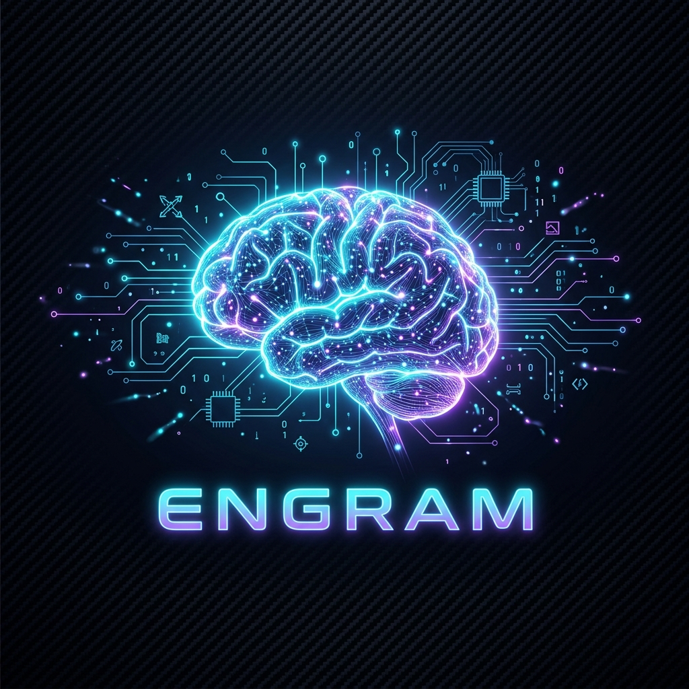
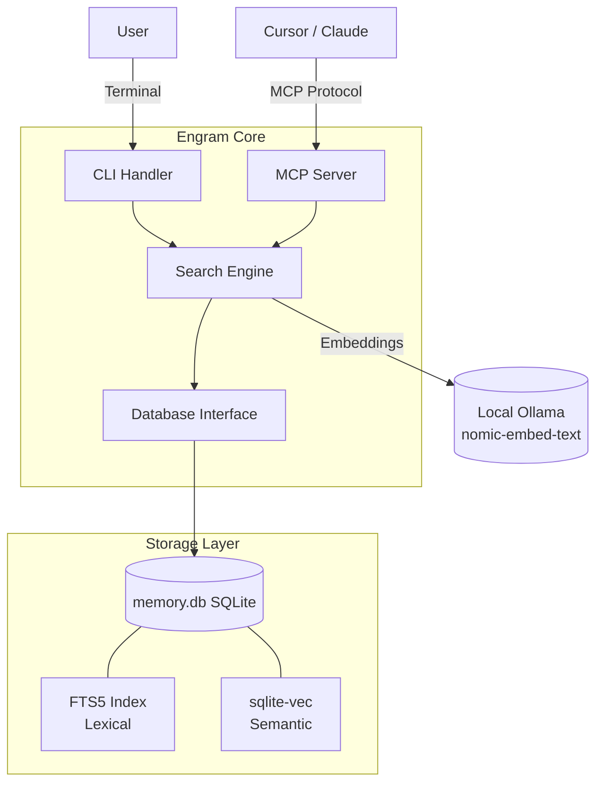
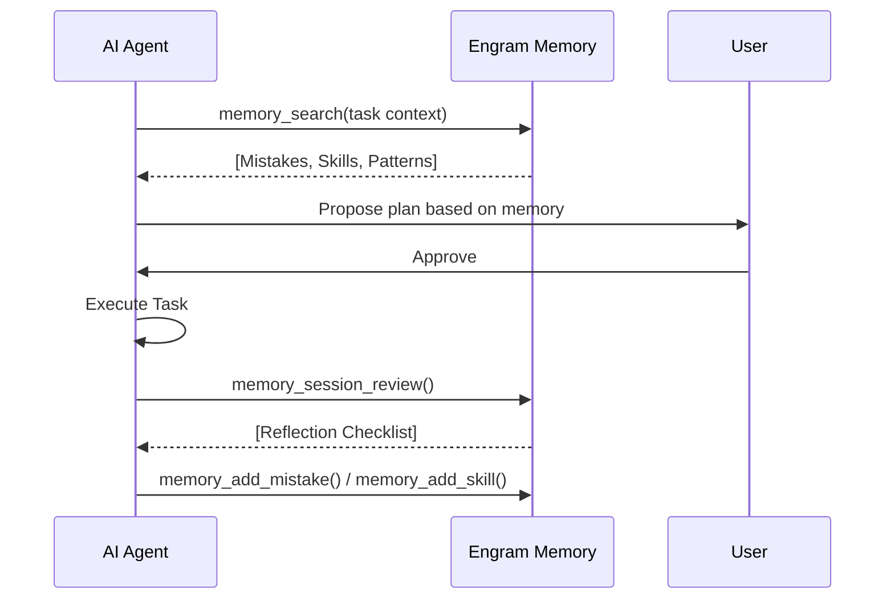

# 🧠 Engram



**Persistent engineering memory for AI-assisted development.**  
Stop repeating mistakes. Reuse proven workflows. Recognize familiar problems instantly.

[](LICENSE)
[](https://python.org)
[](#architecture)

---

## Why Engram?

AI assistants are brilliant but stateless. They forget every lesson learned as soon as a chat session ends. Engram fixes this by maintaining a **queryable memory database** that persists across sessions and projects:

- **Mistakes** — "We tried flood-fill on alpha edges before, it doesn't work. Use the tinting approach."
- **Patterns** — "This looks like the API Parameter Mismatch pattern. Look up the ID from the listing endpoint first."
- **Skills** — "There's already a proven workflow for this. Follow steps 1-5 instead of figuring it out again."
- **Codebase Knowledge** — "I've mapped this project. Here are the key file summaries without re-reading everything."

## Architecture

Engram uses a hybrid search engine combining **SQLite FTS5** (lexical) and **sqlite-vec** (semantic) to retrieve relevant context.



## Quick Start

The easiest way to get started is using the unified setup script:

```bash
git clone https://github.com/luismiguelcota/engram.git
cd engram
bash scripts/setup.sh
```

This script will:
1. Check your Python environment (>= 3.9).
2. Install dependencies (`sqlite-vec`, `sqlean-py`).
3. Configure **Ollama** for semantic search.
4. Initialize and seed your local memory database.

## Agent Integration

Engram turns AI assistants into senior partners who remember your project's history.

### 1. Bootstrap your Project
Run this in any repository you want your AI agent to remember:
```bash
engram bootstrap
```
This creates `.cursor/rules/engram.mdc` for Cursor and `.antigravity/instructions.md` for Antigravity, enforcing the **Committee-Driven Workflow**.

### 2. Committee-Driven Workflow
Engram encourages a structured SDLC where agents act as a "committee" (Analyst, Researcher, Skeptic, Archivist) to prevent shallow decisions.



## Claw-Code Integration (Optional)

Engram integrates directly with **Claw-Code** for high-performance execution. Use Claw as your agent's execution engine to get ultra-fast results while logging everything to Engram:

```bash
engram run "Optimizing image pipeline" --role Analyst --session-id "IMG-01"
```

*Note: Requires `claw` binary to be in your PATH or configured in `.env`.*

## CLI Reference

| Command | Description |
|---------|-------------|
| `engram search "query"` | Search all memory (lexical + semantic) |
| `engram recent` | Show the 10 most recent memory entries |
| `engram add mistake` | Log a new mistake with root cause |
| `engram index-project` | Create a persistent map of the current codebase |
| `engram query-codebase` | Search project-specific file summaries |
| `engram doctor` | Run diagnostics and fix database issues |

## Troubleshooting

If things aren't working as expected, run the built-in diagnostic tool:
```bash
engram doctor --repair
```
It will check for database drift, orphaned tags, and semantic engine connectivity.

## License

[MIT](LICENSE) — Luis Miguel Cota
